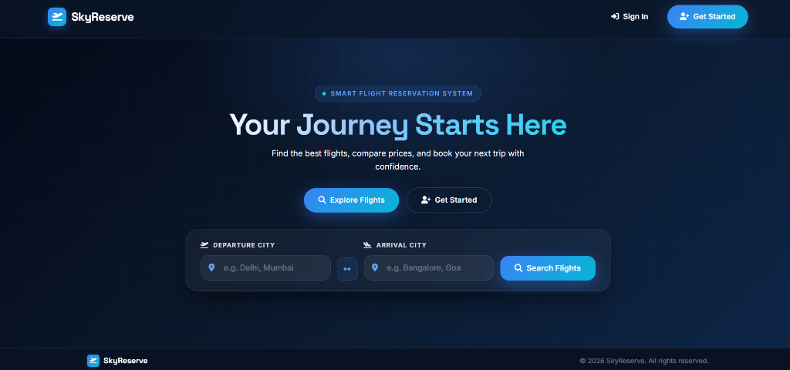
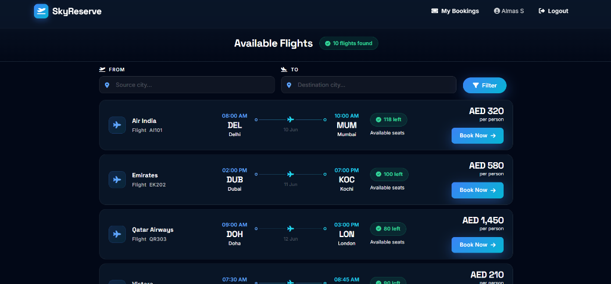
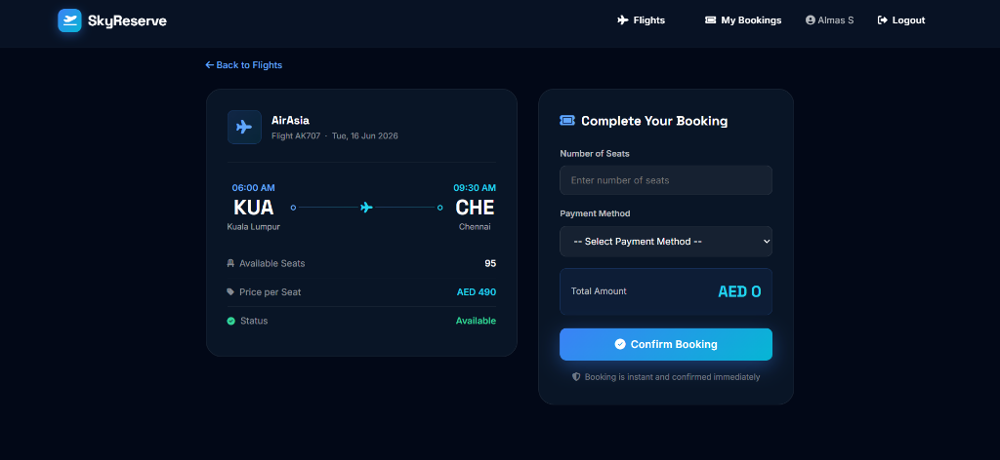
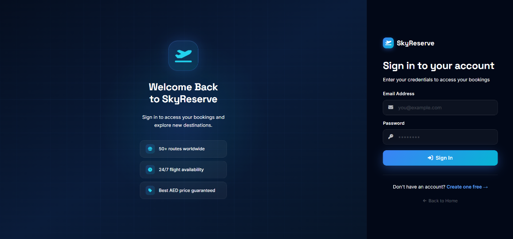
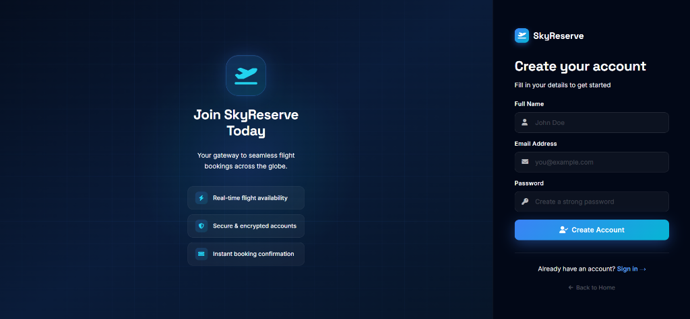

# ✈️ Flight Reservation System (SkyReserve)

> A modern, full-stack database-driven web application for flight schedule management, real-time fare browsing, user authentication, and instant seat booking built with **PHP 8**, **MySQL 8**, and **Vanilla CSS**.

---

## 📌 Abstract

The **Flight Reservation System** automates airline schedule management, user registration, seat availability tracking, and booking processing. Built on relational database principles, the project showcases core and advanced Database Systems (DBMS) features including:
- **3NF Relational Database Schema**
- **Automated MySQL Triggers** (real-time seat deduction & integrity checks)
- **Database Views & Stored Procedures**
- **Deterministic MySQL Functions**
- **Modern Responsive Dark-Theme UI**

---

## ⚡ Quick Start (Run in 1 Command with Docker)

No PHP installation, MySQL configuration, or manual imports required!

```bash
# 1. Clone the repository
git clone https://github.com/your-username/Flight-Reservation-System.git
cd Flight-Reservation-System

# 2. Start application container
docker-compose up -d
```

Open your browser and navigate to: **`http://localhost:8080`**

---

## 🛠️ Alternative Setup (XAMPP / Local Server)

### Prerequisites
- **XAMPP / WAMP / MAMP** (PHP 7.4+ or PHP 8.x, MySQL 5.7+ or MySQL 8.x)
- Web browser (Chrome, Firefox, Edge, Safari)

### Step 1: Local Setup & File Placement
1. Clone or extract the project into your local server root:
   - **XAMPP (Windows):** `C:\xampp\htdocs\Flight-Reservation-System`
   - **XAMPP (macOS):** `/Applications/XAMPP/htdocs/Flight-Reservation-System`

### Step 2: Database Setup
1. Start **Apache** and **MySQL** in your XAMPP Control Panel.
2. Open phpMyAdmin at `http://localhost/phpmyadmin`.
3. Create a new database named **`flight_reservation_system`**.
4. Click **Import** and select the **`flight_reservation_system.sql`** file from the project folder.

### Step 3: Environment Configuration (Optional)
Copy `.env.example` to `.env` or configure database variables directly in `config.php`:
```bash
cp .env.example .env
```
Default connection parameters in `config.php`:
```php
$host     = getenv('DB_HOST') ?: "localhost";
$username = getenv('DB_USER') ?: "root";
$password = getenv('DB_PASS') !== false ? getenv('DB_PASS') : "";
$database = getenv('DB_NAME') ?: "flight_reservation_system";
```

### Step 4: Run Application
Open your browser and visit:
```text
http://localhost/Flight-Reservation-System/
```

---

## 🌟 Key Features

- **✈️ Flight Browsing & Filtering:** Filter live schedules by departure/arrival city with instant result counts.
- **🔐 User Authentication:** Secure registration and login session management.
- **🎟️ Instant Booking:** Real-time seat availability verification, dynamic price calculation, and payment method selection.
- **📜 Booking History:** Interactive user dashboard displaying confirmed reservations and payment statuses.
- **⚡ Automatic Inventory Management:** MySQL triggers automatically decrement available flight seats upon confirmation.

---

## 📂 Project Structure

```text
Flight-Reservation-System
├── .env.example             # Template for environment variables
├── .gitignore               # Excluded files for git repository
├── Dockerfile               # Apache + PHP 8 container configuration
├── docker-compose.yml       # Multi-container orchestration (PHP + MySQL)
├── config.php               # Database connection configuration
├── index.php                # Homepage & flight search widget
├── flights.php              # Available flights listing & filter
├── book.php                 # Flight reservation & payment form
├── my_bookings.php          # User booking history dashboard
├── login.php                # User sign-in page
├── register.php             # New account registration page
├── logout.php               # Session termination script
├── style.css                # Custom CSS design system
├── flight_reservation_system.sql # Complete database DDL & seed data
│
├── screenshots/             # Interface previews for GitHub documentation
│   ├── home.png
│   ├── login.png
│   ├── register.png
│   ├── flights.png
│   └── book.png
│
└── README.md                # Project documentation
```

---

## 📸 Interface Showcase

### 1. Landing Page


### 2. Available Flights List


### 3. Flight Reservation & Payment


### 4. Account Sign In


### 5. Account Registration


---

## 🗄️ Database Architecture & Design

### Relational Schema Tables
- **`users`** — User account records (`user_id`, `full_name`, `email`, `phone`, `password`).
- **`flights`** — Flight schedules (`flight_id`, `flight_number`, `airline_name`, `source_city`, `destination_city`, `departure_time`, `arrival_time`, `available_seats`, `ticket_price`).
- **`bookings`** — Passenger reservations (`booking_id`, `user_id`, `flight_id`, `booking_date`, `seats_booked`, `booking_status`).
- **`payments`** — Transaction records (`payment_id`, `booking_id`, `payment_method`, `amount`, `payment_status`).

### Advanced DBMS Features Implemented
1. **Triggers:**
   - `reduce_seats_after_booking` — Automatically deducts booked seats from `flights.available_seats` after a booking row is inserted.
   - `prevent_negative_seats` — Enforces non-negative seat inventory prior to updating `flights`.
2. **Stored Procedures & Functions:**
   - `TotalFlights()` & `TotalRevenue()` — Deterministic aggregate metrics.
   - `GetAllFlights()`, `GetAllUsers()`, `GetFlightsByAirline()` — Encapsulated query procedures.
3. **Views:**
   - `booking_details` & `flight_summary` — Simplifies reporting queries across joined entities.

---

## 🔧 Troubleshooting Common Issues

1. **MySQL Access Denied Error:**
   - Ensure your MySQL service is running in XAMPP.
   - If your MySQL `root` account has a password, update `$password` in `config.php` or set `DB_PASS` in your environment.
2. **Page Not Found (404):**
   - Verify the project folder name matches `Flight-Reservation-System` inside `htdocs`.
3. **Docker Port Conflict:**
   - If port `8080` or `3306` is already in use, modify the host port mappings in `docker-compose.yml`.

---

## 🎓 Academic Information

- **Course:** Database Systems
- **Institution:** BITS Pilani Dubai Campus
- **Project Title:** Flight Reservation System

---

## 📄 License

This project is open-source and available under the **MIT License**.
